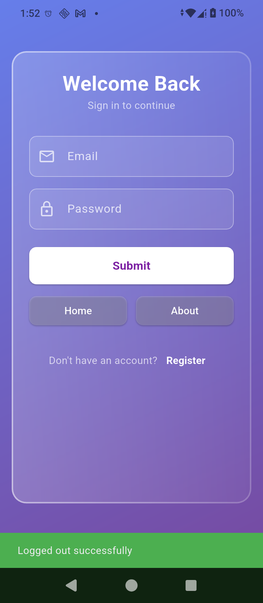
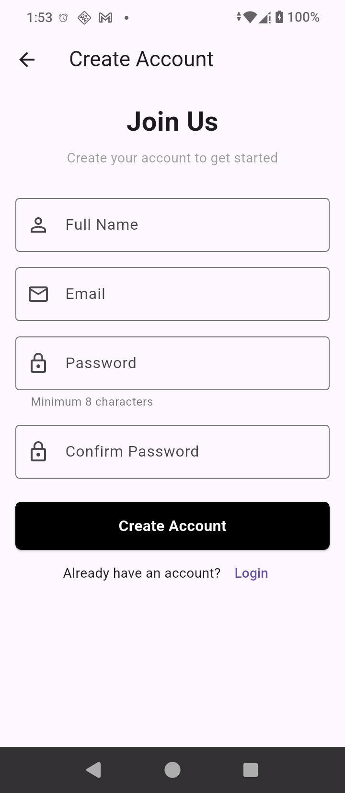
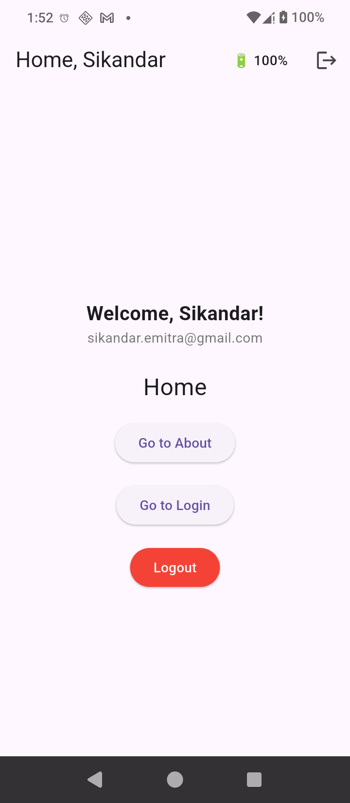
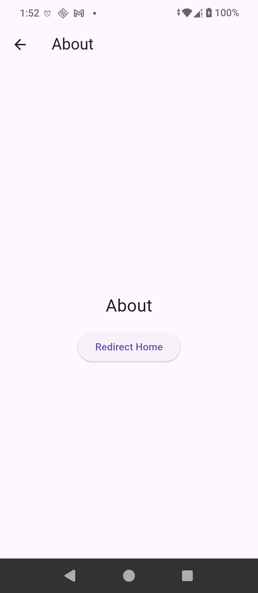

# 🔐 Flutter Auth App

A production-ready authentication system built with Flutter, Express, and JWT. Features secure token storage, protected routes, glassmorphism UI, and real-time device telemetry.

## 📸 Screenshots

<div style="display: flex; flex-wrap: wrap; gap: 16px; justify-content: center; align-items: flex-start;">

<div style="flex: 0 0 200px; text-align: center;">
    <br>
    <strong>Login</strong><br>
    <em style="font-size: 12px; color: #666;">Glassmorphism UI + form validation</em>
</div>

<div style="flex: 0 0 200px; text-align: center;">
<br>
<strong>Register</strong><br>
<em style="font-size: 12px; color: #666;">Password rules + real-time feedback</em>
</div>

<div style="flex: 0 0 200px; text-align: center;">
<br>
<strong>Home</strong><br>
<em style="font-size: 12px; color: #666;">User greeting + battery sync + logout</em>
</div>

<div style="flex: 0 0 200px; text-align: center;">
<br>
<strong>About</strong><br>
<em style="font-size: 12px; color: #666;">Protected route with app info</em>
</div>

</div>

## ✨ Features

### 🔐 Authentication

- **JWT Login/Register:** Secure token-based auth with Express backend
- **Password Validation:** Zod schema enforces 8+ chars, uppercase, lowercase, number
- **Secure Storage:** Tokens + user data encrypted via `flutter_secure_storage`
- **AuthGuard/GuestGuard:** Auto-redirect unauthenticated users; skip login if already authenticated
- **Logout Flow:** Clears tokens + navigation stack to prevent back-button leaks

## 🎨 UI/UX

- **Glassmorphism Login:** Frosted glass effect with gradient background (`glassmorphism` package)
- **Responsive Layout:** Works on phones, tablets, and foldables
- **Loading States:** Spinners + disabled buttons during async operations
- **SnackBar Feedback:** Success/error messages for all auth actions
- **Debug Buttons:** Quick route testing in development mode (`kDebugMode`)

## 🔋 Device Telemetry (Foreground)

- **Battery Sync:** Sends battery level + charging state to backend every 5 seconds
- **In-Memory Logging:** `/api/battery` endpoint stores data in array (testing only)
- **Real-Time UI:** Current battery % displayed in AppBar
- **Timer Cleanup:** Cancels sync on screen dispose to prevent memory leaks

## 🛡️ Security

- **HTTPS-Ready:** Backend listens on `0.0.0.0` for production deployment
- **Token Expiry:** JWT access/refresh tokens with configurable expiration
- **No Plaintext Secrets:** All sensitive data stored via platform keystore/keychain
- **Fail-Safe Auth:** `getUser()` returns `null` if any field is missing

## 🚧 Coming Soon

- Background battery sync via `workmanager`
- Token refresh logic (auto-renew access token)
- Role-based access control (admin/user/guest)
- Profile edit screen + avatar upload
- Biometric lock on app resume (`local_auth`)
- Database persistence for battery logs (PostgreSQL)
- Rate limiting + API key auth for `/api/battery`

## 🛠 Tech Stack

| Layer               | Technology                                            |
| :------------------ | :---------------------------------------------------- |
| **Frontend**        | Flutter 3.x + Dart 3.x                                |
| **Backend**         | Express.js + TypeScript                               |
| **Auth**            | JWT (`jsonwebtoken`) + `bcryptjs`                     |
| **Storage**         | `flutter_secure_storage` (mobile), Supabase (backend) |
| **Validation**      | Zod (backend), Form + GlobalKey (frontend)            |
| **UI**              | Material 3 + glassmorphism package                    |
| **Networking**      | `http` package + timeout handling                     |
| **Telemetry**       | `battery_plus` + `Timer.periodic`                     |
| **Package Manager** | `pnpm` (backend), `pub` (frontend)                    |

## 🚀 Quick Start

### Prerequisites

- Flutter SDK 3.16+ (flutter doctor -v)
- Node.js 18+ + pnpm (npm install -g pnpm)
- Android Studio / Xcode for device builds
- Supabase account (for PostgreSQL backend)

### Backend Setup

```bash
# 1. Clone repo + navigate to server
git clone https://github.com/sikandarmoyaldev/flutter-auth-app.git
cd flutter-auth-app/server

# 2. Install dependencies
pnpm install

# 3. Configure environment
cp .env.example .env
# Edit .env with your Supabase DATABASE_URL + JWT_SECRET

# 4. Run database migrations
pnpm db:push

# 5. Start dev server
pnpm dev
# → Server running on http://localhost:3000
```

### Flutter App Setup

```bash
# 1. Navigate to app directory
cd ../app

# 2. Install dependencies
flutter pub get

# 3. Configure Android (if using physical device)
#    - Enable USB debugging
#    - Run: adb reverse tcp:3000 tcp:3000

# 4. Run the app
flutter run
# → Scan QR code with Expo Go or launch on emulator
```

### Test the Flow

- Register a new user → tokens saved securely
- Login → redirected to HomeScreen with user greeting
- Watch AppBar → battery % updates every 5 seconds
- Tap Logout → tokens cleared + redirected to login
- Press back → can't return to protected pages (stack cleared)

## 📁 Project Structure

```bash
flutter-auth-app/
├── app/                          # Flutter frontend
│   ├── lib/
│   │   ├── app/
│   │   │   ├── app.dart         # MaterialApp config + auth startup
│   │   │   └── routes/
│   │   │       ├── app_routes.dart  # Route constants
│   │   │       └── app_router.dart  # Route map + guards
│   │   ├── core/
│   │   │   └── widgets/
│   │   │       ├── auth_guard.dart  # Protects authenticated routes
│   │   │       └── guest_guard.dart # Skips auth if logged in
│   │   ├── features/
│   │   │   ├── auth/
│   │   │   │   ├── screens/
│   │   │   │   │   ├── login_screen.dart
│   │   │   │   │   └── register_screen.dart
│   │   │   │   ├── services/
│   │   │   │   │   └── auth_api.dart  # Login/register/logout/getUser
│   │   │   │   └── widgets/
│   │   │   ├── battery/
│   │   │   │   └── battery_api.dart   # sendBatteryToBackend()
│   │   ├── screens/
│   │   │   ├── home_screen.dart       # Dashboard + battery sync
│   │   │   └── about_screen.dart      # Protected info page
│   │   └── main.dart
│   ├── pubspec.yaml
│   └── screenshots/                   # App preview images
│
├── server/                       # Express backend
│   ├── src/
│   │   ├── app.ts               # Server setup + /api/battery route
│   │   ├── routes/
│   │   │   └── auth.ts          # POST /login, /register, /battery
│   │   ├── services/
│   │   │   └── auth.service.ts  # User CRUD + password hashing
│   │   ├── utils/
│   │   │   ├── jwt.ts           # Token generation/verification
│   │   │   └── sanitize.ts      # Exclude password from responses
│   │   └── lib/
│   │       └── db.ts            # Supabase + Drizzle ORM setup
│   ├── .env.example
│   ├── drizzle.config.ts
│   └── package.json
│
└── README.md
```

## 🔐 Security Notes

### Tokens

- Access token: Short-lived (1 hour), sent in `Authorization: Bearer <token>` header
- Refresh token: Long-lived (30 days), stored securely, used to renew access token
- Never store tokens in `SharedPreferences` — use `flutter_secure_storage`

### Passwords

- Hashed with `bcryptjs` (salt rounds: 10) before database storage
- Validation enforced on both frontend (UX) and backend (security)

### Routes

- Protected routes (`/home`, `/about`) wrapped in `AuthGuard`
- Guest routes (`/auth/login`, `/auth/register`) wrapped in `GuestGuard`
- All auth checks happen client-side + should be verified server-side for API calls

### Battery Endpoint (/api/battery)

- Currently accepts any valid JWT (no user validation)
- Stores data in-memory only (lost on server restart)
- For production: Add rate limiting, user ID validation, and database persistence

## 🧪 Testing

### Backend

```bash
# Test login with curl
curl -X POST http://localhost:3000/api/auth/login \
  -H "Content-Type: application/json" \
  -d '{"email":"test@example.com","password":"Test123!"}'

# Test battery endpoint
curl -X POST http://localhost:3000/api/battery \
  -H "Content-Type: application/json" \
  -H "Authorization: Bearer <YOUR_JWT>" \
  -d '{"batteryLevel":87,"isCharging":true,"timestamp":"2024-04-22T10:30:00Z"}'
```

### Frontend

```bash
# Run with verbose logging to see auth flow
flutter run -v | grep "I/flutter.*🔐\|📤\|📥"

# Test AuthGuard bypass (debug only)
# Add temp button in LoginScreen:
ElevatedButton(
  onPressed: () => Navigator.pushNamed(context, AppRoutes.home),
  child: Text('🔓 Test Bypass'),
)
# → Should redirect to login if not authenticated
```

## 🤝 Contributing

- Fork the repo
- Create a feature branch: `git checkout -b feat/your-feature`
- Commit changes: `git commit -m "feat(scope): short description"`
- Push: `git push origin feat/your-feature`
- Open a Pull Request

### Commit Convention

```bash
feat(auth): add refresh token rotation
- bullet point with implementation details
- another bullet for testing notes

fix(ui): resolve glassmorphism height error on small screens
- add dynamic height calculation via MediaQuery
```

## 🙏 Acknowledgments

- [glassmorphism](https://pub.dev/packages/glassmorphism) for the frosted glass UI
- [flutter_secure_storage](https://pub.dev/packages/flutter_secure_storage) for encrypted storage
- [battery_plus](https://pub.dev/packages/battery_plus) for device telemetry
- Express + Zod + bcryptjs for robust backend auth
